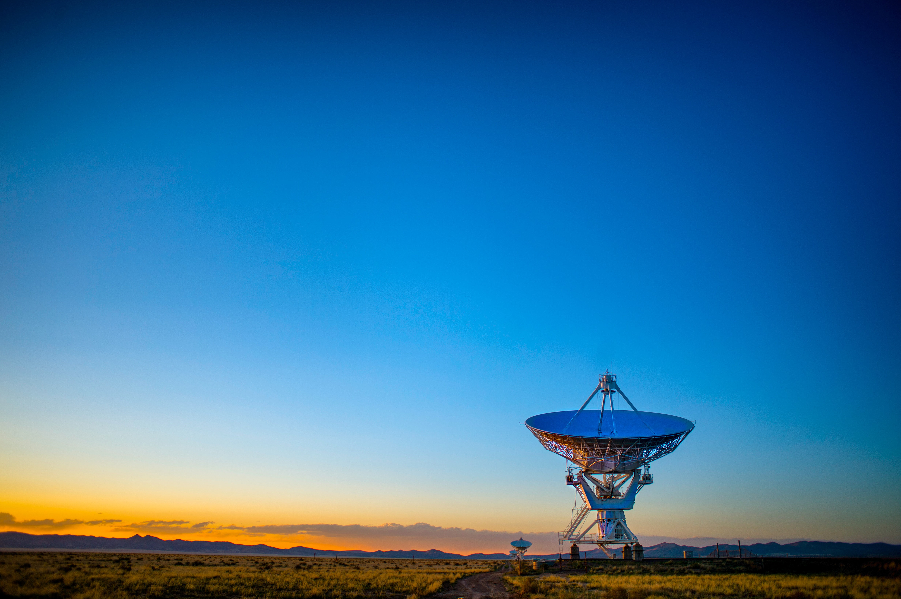

In this blog we will explore the fascinating intersection of data technology and the space industry. Discover the transformative power of data streaming and ETL (Extract, Transform, Load) processes, uncovering how they are reshaping the way we explore and understand the cosmos. Join me on this exciting journey as we explore the significant impact these technologies have on space operations, research, and the growth of space startups. With a focus on cutting-edge data tech stack, I aim to shed light on the immense opportunities awaiting businesses in the space industry.
{: .notice--info}

## I. Introduction

The space industry has undergone a paradigm shift with the adoption of data streaming and ETL processes. These technologies are revolutionizing space operations, satellite missions, and research endeavors, opening up a new era of possibilities. Let's explore some compelling use cases where data streaming and ETL have made a remarkable impact:

1. **Enhancing Satellite Operations:** Data streaming enables real-time monitoring of satellite telemetry, sensor data, and operational parameters. By implementing robust data streaming pipelines, businesses in the space industry can gain immediate insights into satellite health, optimize operations, and ensure uninterrupted data collection.
2. **Enabling Data-Driven Space Research:** Data science in the space industry has witnessed a tremendous surge, fueled by the abundance of available data. By employing advanced data science techniques and leveraging data streaming capabilities, researchers can analyze vast datasets collected from satellites, space probes, and telescopes to uncover celestial phenomena, study cosmic radiation, and gain deeper insights into the universe.
3. **Empowering Space Startups:** Space startups are leveraging the latest data tech stack to disrupt the industry. By harnessing data streaming and ETL processes, these startups can process massive volumes of satellite imagery, Earth observation data, and sensor readings in real time. This enables them to develop innovative solutions for weather forecasting, environmental monitoring, precision agriculture, and more.

## II. Use-case Study in the Space Industry

In this section,, let's delve into a captivating use case study that showcases how data streaming is revolutionizing the space industry, enabling scientists and engineers to uncover new frontiers and push the boundaries of human knowledge.

### Use Case:

Enhancing Satellite Operations and Earth Observation

### Background:

In this use case, we'll focus on a space agency responsible for operating a constellation of Earth observation satellites deployed for environmental monitoring, disaster management, and climate analysis. The agency's goal is to optimize satellite operations, ensure data continuity, and provide timely and accurate information to support decision-making processes.

### Challenge:

The agency faced the challenge of handling a massive influx of data from multiple satellites orbiting the Earth. They needed a solution that could handle the continuous stream of telemetry data, sensor readings, and imagery captured by the satellites, enabling real-time monitoring, analysis, and efficient data delivery.

### Data Streaming Solution:

To address these challenges, the space agency implemented a robust data streaming solution that integrated various components:

- **Satellite Telemetry and Sensor Data:** Real-time telemetry data and sensor readings from each satellite were continuously streamed to a centralized data processing system using a data ingestion framework like Apache Kafka. This enabled the agency to handle the high-volume data streams and ensured data durability and availability. The streaming data included information on satellite health, orbital parameters, sensor calibrations, and operational status.
- **Image and Video Streaming:** High-resolution imagery and video captured by the satellites were streamed to a dedicated data processing pipeline.  This pipeline leveraged technologies like Apache Kafka or AWS Kinesis to handle the continuous streams of image and video data. By employing a distributed file system like Hadoop Distributed File System (HDFS) or object storage services such as Amazon S3 or Azure Blob Storage, the agency could efficiently store and manage the vast amount of imagery and video data.
- **Real-Time Data Analytics:** The streaming data was processed in real time using advanced analytics algorithms powered by stream processing frameworks like Apache Flink. These frameworks enabled the agency to perform real-time data transformations, aggregations, and anomaly detection on the incoming data streams. By employing custom-developed algorithms or leveraging machine learning models, the agency could extract key insights from the telemetry, sensor, and imagery data streams.
**Data Delivery and Visualization:** Processed data and imagery were delivered to stakeholders in near-real-time, enabling timely decision-making. An interactive data visualization platform, built using tools like Tableau or custom web technologies, provided intuitive dashboards and interactive maps. This allowed stakeholders, including scientists and policymakers, to explore and analyze the data effortlessly, facilitating collaboration and knowledge exchange.

### Benefits and Outcomes:

The implementation of data streaming technologies yielded significant benefits and outcomes for the space agency:

- **Real-Time Monitoring and Response:** The agency gained instant visibility into satellite performance through real-time telemetry and sensor data streaming. This enabled them to identify issues promptly and take immediate corrective actions, ensuring uninterrupted data collection and improving overall mission success rates. 
- **Timely Environmental Insights:** By leveraging real-time data streaming, scientists and stakeholders could access up-to-the-minute environmental data, empowering them to make accurate weather forecasts, conduct climate analysis, and facilitate effective disaster management. The timely insights provided the agency with the ability to respond swiftly to changing conditions and make informed decisions. 
- **Enhanced Data Continuity:** The continuous stream of satellite data ensured seamless data continuity, minimizing gaps in coverage. This enabled researchers to study long-term environmental trends, track changes in Earth's surface, and provide critical data for policy-making and scientific research.
- **Improved Collaboration and Stakeholder Engagement:** The availability of real-time data and interactive visualization tools fostered collaboration among scientists, policymakers, and other stakeholders. This facilitated data sharing, knowledge exchange, and joint efforts in addressing global challenges related to climate change, natural resource management, and environmental sustainability.

### Conclusion:

This use case exemplifies the transformative power of data streaming in the space industry. By harnessing the capabilities of real-time data processing, analytics, and visualization, the space agency was able to enhance satellite operations, deliver timely environmental insights, ensure data continuity, and foster collaboration among stakeholders. The successful implementation of data streaming technologies highlights the immense potential for businesses in the space industry to leverage real-time data for improved decision-making, scientific advancements, and positive societal impact.

## III. Tech Stack for Data Streaming and ETL in the Space Industry
Having explored the exciting use cases, let's now take a closer look at the technologies that power data streaming and ETL in the space industry. Companies in the space industry leverage a range of tools and platforms to handle the massive volumes of data generated by satellites and space missions. Here are some key components of the data tech stack used in the space industry:

- **Data Streaming Platforms:** Apache Kafka, AWS Kinesis, and Azure Event Hubs provide scalable and real-time data streaming capabilities, allowing businesses to handle large volumes of data from satellites and space missions.
- **ETL Tools:** Leading ETL tools like AWS Glue, Apache NiFi, and Talend Data Integration enable businesses to extract, transform, and load data from various sources into a unified format, ensuring consistent and reliable data analysis.
- **Data Science and Analytics:** Utilizing tools such as Python, R, Apache Spark, and TensorFlow, businesses can perform advanced analytics, machine learning, and deep learning algorithms to extract valuable insights from vast space datasets.

## IV. Careers in the Space Data Industry:

The convergence of aerospace engineering and data technology has created a plethora of exciting career opportunities. Roles such as Space Data Analyst, Satellite Data Engineer, Data Scientist, Data Systems Engineer, and Satellite Operations Specialist are in high demand. Acquiring skills in data streaming, ETL, data science, and analytics can pave the way for a successful and fulfilling career in the space industry.

## V. Conclusion:

The space industry is undergoing a transformative journey powered by data streaming, ETL, and advanced data tech stack. By embracing these technologies, businesses can unlock unprecedented opportunities for satellite operations, space research, and space startups. As aerospace engineers and data professionals, we have the privilege to shape the future of space exploration through our expertise and innovative solutions. Let's embark on this remarkable adventure, revolutionize the space industry, and make new cosmic discoveries along the way.

Are you ready to take your business to new heights in the space industry? Contact us to leverage the power of data streaming, ETL, and advanced data tech stack for your space ventures.
{: .notice--success}