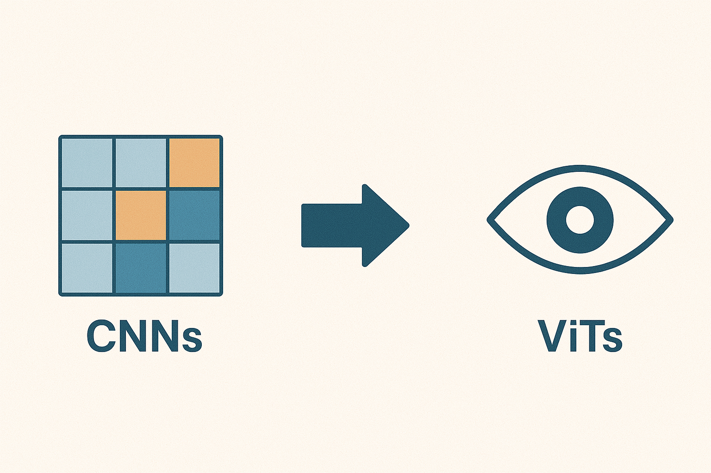
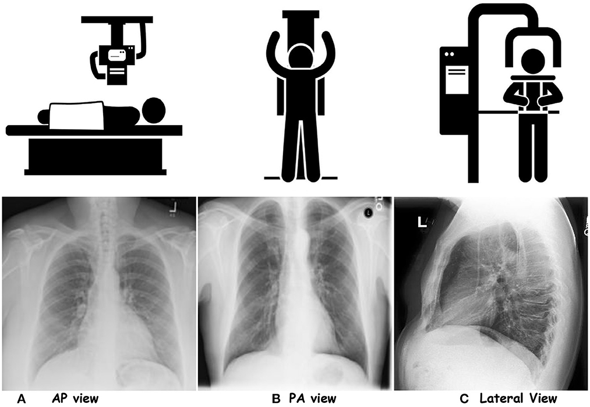

## Introduction: From Aerospace to Pixels

I started my career as an aerospace engineer before moving into Computer Vision. While these fields might seem very different, they actually have something important in common: they both involve making sense of complex information. In aerospace, we analyze how air moves around objects and how structures hold together. In Computer Vision, we teach computers to understand images and visual information.

My background in studying air flow and aircraft design gave me useful skills for working with images and computers. One of the most interesting new tools I've found in this field is called Vision Transformers (or ViTs for short). These are smart computer programs that were inspired by tools originally made for processing language.

In this article, we'll look at Vision Transformers - what they are, how they work, and why they're changing the way computers understand images.

---

## From Convolution Neural Networks to Vision Transformers

### The Dominance of Convolutional Neural Networks (CNNs)

Convolutional Neural Networks(CNNs) have been the main tool used in Computer Vision for many years. These computer programs are great at looking at images and learning to recognize important details in them. They've helped computers get much better at tasks like identifying objects in photos and understanding what's in an image. CNNs work by scanning images with special filters that help them pick out different features. Think of it like looking at a picture through different lenses - each lens helps you see different things. However, CNNs have one main weakness: they're not very good at understanding how different parts of an image relate to each other when they're far apart. This means they sometimes miss the bigger picture of what's happening in a scene.

### From Words to Pixels: The Rise of Vision Transformers

The deep learning tech is constantly evolving. In 2017, the Transformer architecture was introduced in the field of Natural Language Processing (NLP). It demonstrated remarkable success in tasks like machine translation (text analysis). Transformers rely on a mechanism called "attention," which allows the model to weigh the importance of different parts of the input sequence and thus capturing both local and global relationships.

Then came the groundbreaking question: could we adapt Transformers to process images? In 2020, the Vision Transformer was introduced, which treats an image as a sequence of patches called as "tokens," similar to words in a sentence. This enables ViTs to effectively learn the relationships between different image regions, leading to a more holistic understanding of the visual content.

Here's a simplified breakdown of how Vision Transformers work:

1. **Image Patching:** An input image is divided into a grid of smaller, non-overlapping patches
2. **Linear Embedding:** Each patch is flattened into a vector and then linearly transformed into a higher-dimensional space.
3. **Sequence Input:** These embedded patches are treated as a sequence, similar to words in a sentence.
4. **Transformer Encoder:** This sequence of embedded patches is fed into a standard Transformer encoder, which consists of multiple layers of self-attention and feed-forward networks.
5. **Output:** The Transformer processes the sequence, and the output can be used for various tasks like image classification, object detection, or semantic segmentation.

### Why Vision Transformers are Replacing CNNs

ViTs are increasingly replacing CNNs in many computer vision tasks due to their superior ability to model long-range dependencies and capture global context. CNNs excel at extracting local features through convolutional layers but they struggle to integrate information from distant parts of an image. This limitation hinders their performance in tasks where understanding the overall scene is crucial. 

ViTs employ self-attention mechanisms that allow them to weigh the importance of different image regions and thus they effectively capture both local and global relationships. As a result, ViTs achieve higher accuracy and better generalization, especially on large datasets. Additionally, the flexibility and scalability of the Transformer architecture make ViTs well-suited for a wide range of computer vision applications.

#### **Comparison: ViT vs. Swin Transformer vs. CNNs**

| Feature | Vision Transformer | Swin Transformer | CNNs |
| --- | --- | --- | --- |
| Global Context | Excellent | Excellent | Limited |
| Local Context | Limited | Good | Excellent |
| Computational Cost | High | Moderate | Low |
| Scalability | High | High | Moderate |
| Flexibility | High | High | Moderate |
| Performance | State-of-the-art on large datasets | State-of-the-art on various tasks, efficient for high-resolution images | Good for many tasks, especially with limited data |
| Key Advantage | Captures long-range dependencies effectively | Efficiently models both local and global relationships | Computationally efficient, strong inductive bias for local patterns |
| Use Cases | Image classification, object detection on large data | Object detection, segmentation, particularly for high-resolution images | Image classification, especially with limited data, real-time applications |

---

## **Practical Applications of Vision Transformers**

The versatility and power of Vision Transformers have opened up exciting possibilities across diverse industries:

- **Medical Imaging:** ViTs are being used to improve medical image analysis that aids in the diagnosis of diseases like cancer and Alzheimer's. For example, researchers have developed ViT-based models that can accurately detect tumors in MRI scans, leading to early diagnosis and more effective treatments.
    

*Chest-X rays for three projections. **(A)** AP view, **(B)** PA view, and **(C)** Lateral View. Downloaded from [https://www.frontiersin.org/journals/big-data/articles/10.3389/fdata.2023.1120989/full](https://www.frontiersin.org/journals/big-data/articles/10.3389/fdata.2023.1120989/full)*
    
- **Autonomous Vehicles:** ViTs enhance the perception capabilities of self-driving cars and thus enable them to better understand their surroundings and make more informed decisions. Companies like Waymo are using ViTs to improve object detection and scene understanding, allowing their vehicles to navigate complex urban environments with greater accuracy.
    

*Downloaded from [https://news.mit.edu/2023/ai-model-high-resolution-computer-vision-0912](https://news.mit.edu/2023/ai-model-high-resolution-computer-vision-0912)*
    
- **Security:** ViTs are being applied in security systems for tasks such as facial recognition and anomaly detection. For instance, ViT-based models can identify individuals in crowded scenes with high precision.
- **Retail:** ViTs are used in retail to improve product recognition, personalize shopping experiences, and automate inventory management. Amazon uses ViTs in their automated warehouses to identify and track products and streamline their logistics and delivery processes.
- **Agriculture:** ViTs can help farmers monitor crop health, detect diseases, and optimize yields. Companies are developing ViT-powered drones that can analyze images of crops to detect signs of stress or disease.
- **Environmental Monitoring:** ViTs can be used to analyze satellite imagery to track deforestation, monitor pollution levels, and assess the impact of climate change. NASA is using ViTs to collect valuable data through satellite images to monitor changes in the Earth's environment.

*Differentiating different types of deforestation from satellite imagery. Downloaded from [Medium](https://medium.com/meteory-blog/monitoring-forests-globally-how-satellite-data-is-used-to-detect-deforestation-e0db34abe453)*

---

## **The Future of Image Processing**

ViTs are not meant to replace CNNs entirely. The future likely involves hybrid architectures that combine the strengths of both. For example, some architectures use CNNs to extract local features and then use Transformers to model the relationships between those features.  

As research in Vision Transformers continues to advance, we can expect even more groundbreaking applications in the future. Some exciting areas of development include:

- **Efficient ViT Architectures:** Research is ongoing to reduce the computational cost of ViTs, making them more practical for real-world applications.
- **Self-Supervised Learning:** Combining ViTs with self-supervised learning techniques to reduce the reliance on large labeled datasets.
- **Multimodal Applications:** Combining ViTs with other modalities, such as text and audio, to create more comprehensive AI systems.
- **Applications in Robotics and Autonomous Systems**: Using ViTs for better scene understanding and navigation.
- **Explainability:** Improving the interpretability of ViTs to understand how they make decisions, fostering trust and transparency.

---

## **Actionable Insights and Takeaways**

- Vision Transformers are a powerful new tool for image processing, offering significant advantages over traditional CNNs in terms of capturing global context and long-range dependencies.
- ViTs have the potential to revolutionize various industries, including healthcare, autonomous vehicles, and security, by enabling more accurate and efficient image analysis.
- Researchers are actively working to improve the efficiency and explainability of ViTs, making them more practical and trustworthy for real-world applications.
- Businesses and organizations should consider exploring the potential of ViTs to enhance their image processing capabilities and gain a competitive edge.

## **Conclusion**

Vision Transformers represent a significant leap forward in image processing, offering a fresh perspective on how machines can understand and interpret visual information. With their ability to capture global context, scalability, and flexibility, ViTs are poised to revolutionize various industries and shape the future of artificial intelligence. As researchers continue to unlock their full potential, we can anticipate even more exciting applications and breakthroughs in the years to come.

**Keywords:** Vision Transformers, ViTs, Computer Vision, Image Processing, Convolutional Neural Networks, CNNs, Deep Learning, Attention Mechanism, Artificial Intelligence, Image Recognition, Machine Learning.